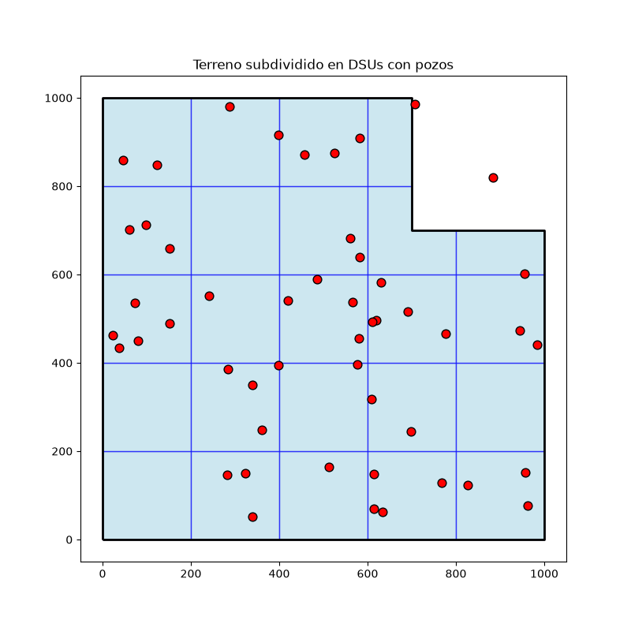

# Pipeline ETL — Oil & Gas (Acreage, Wells, DSUs)

Pipeline ETL completo en Python que simula el trabajo diario de un Python
Developer en una operación de Oil & Gas: extraer datos de una API propia
(con autenticación), validarlos, cargarlos en una base de datos, subdividir
un terreno en unidades de perforación (DSUs) y visualizar los pozos en 2D y 3D.

Lo armé para prepararme para una vacante real de Python Developer en el
sector Oil & Gas, que pedía justamente: scripting en Python, automatización,
calidad de datos, interacción con bases de datos, extracción desde APIs de
terceros, y procesamiento GIS (subdividir polígonos de terrenos en DSUs,
visualizar pozos, garantizar integridad espacial).

## Arquitectura del pipeline


API propia (Flask, con autenticación)
│
▼
EXTRACT (extract.py)
→ pedido HTTP autenticado con requests
│
▼
QUALITY CHECKS (quality_checks.py)
→ detecta duplicados, nulos, coordenadas fuera de rango,
referencias huérfanas
│
▼
TRANSFORM + LOAD (transform_load.py)
→ limpieza, normalización, carga a SQLite
│
▼
GIS SUBDIVIDE (subdivide.py)
→ subdivide el terreno en DSUs, valida integridad espacial
(sin huecos, sin áreas huérfanas), grafica el mapa 2D
│
▼
VISUALIZACIÓN 3D (plot3d.py)
→ pozos como trayectorias verticales, coloreados por status


## Capturas

### Mapa 2D — Terreno subdividido en DSUs con pozos



### Visualización 3D — Trayectorias de pozos por profundidad

El gráfico 3D es un archivo HTML interactivo (rotable, con zoom).
GitHub no lo puede mostrar embebido, pero podés verlo así:

1. Cloná el repo (o descargalo)
2. Abrí `output/pozos_3d.html` con doble click — se abre en tu navegador

## Qué valida la etapa de calidad de datos

El pipeline recibe pozos de la API con errores típicos de datos reales,
y los detecta automáticamente:

| Problema | Ejemplo |
|---|---|
| `well_id` duplicado | Un pozo repetido con el mismo ID |
| Campo obligatorio faltante | Coordenadas `x`/`y` en `null` |
| Coordenada fuera de rango | Un pozo con `y` fuera de los límites del terreno |
| Referencia huérfana | Un pozo que apunta a un `lease_id` que no existe |

Los pozos rechazados quedan registrados con el motivo exacto en
`data/processed/wells_rejected.json`; solo los válidos pasan a la base de datos.

## Qué valida la etapa GIS

La subdivisión en DSUs se hace generando una grilla y **recortándola
matemáticamente contra el polígono real** del terreno (no generando
rectángulos sueltos que "deberían" encajar). Esto garantiza matemáticamente:

- **Sin huecos**: la unión de todas las DSUs reconstruye exactamente el
  área del terreno original.
- **Sin áreas huérfanas**: ninguna DSU tiene área fuera del terreno.

## Autenticación de la API

`api_server.py` protege los endpoints `/leases` y `/wells` con un header
`X-API-Key`. Un pedido sin la clave correcta recibe `401 Unauthorized`.
La clave se maneja por variable de entorno (`.env`, no se sube al repo)
en vez de estar escrita en el código — la misma práctica que usarías
contra una API paga real.

## Stack

Python 3 · Flask · requests · python-dotenv · pandas · GeoPandas · Shapely
· SQLite · Matplotlib · Plotly

## Cómo correrlo

Necesitás **dos terminales** abiertas al mismo tiempo (una para la API,
otra para el pipeline).

```bash
git clone https://github.com/FrancoAyala/pipeline-etl-yacimiento-petrolero.git
cd pipeline-etl-yacimiento-petrolero

python -m venv .venv
.venv\Scripts\activate        # Windows
# source .venv/bin/activate   # Mac/Linux

pip install -r requirements.txt

cp .env.example .env          # ya viene con una clave demo lista para usar
```

**Terminal 1 — levantá la API** (dejala corriendo, no la cierres):
```bash
python src/api_server.py
```

**Terminal 2 — corré cada etapa del pipeline, en orden:**
```bash
python src/extract.py
python src/quality_checks.py
python src/transform_load.py
python src/subdivide.py
python src/plot3d.py
```

## Estructura del repo


pipeline-etl-yacimiento-petrolero/
├── src/
│ ├── api_server.py # Servidor Flask con autenticación por API key
│ ├── extract.py # Extracción: pedido HTTP autenticado
│ ├── quality_checks.py # 4 reglas de validación de calidad de datos
│ ├── transform_load.py # Transformación + carga a SQLite + consultas SQL
│ ├── subdivide.py # GIS: subdivisión en DSUs, validación espacial, mapa 2D
│ └── plot3d.py # Visualización 3D interactiva de pozos
├── data/
│ ├── raw/ # JSON crudo "de la API"
│ └── processed/ # Datos validados, rechazados, leases limpios
├── db/ # Base de datos SQLite (generada al correr el pipeline)
├── output/
│ ├── mapa.png # Mapa 2D final
│ └── pozos_3d.html # Visualización 3D interactiva
├── .env.example # Plantilla de variables de entorno (SÍ se sube)
├── .gitignore
├── requirements.txt
└── README.md